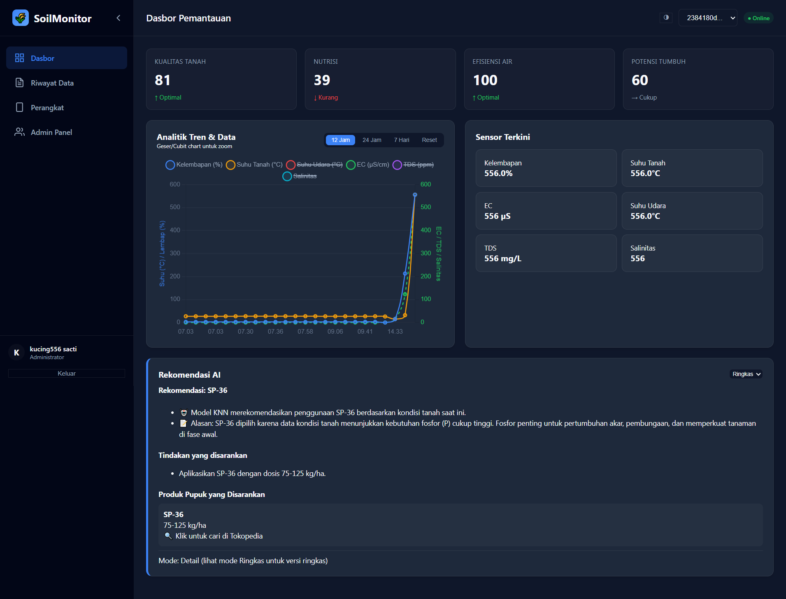
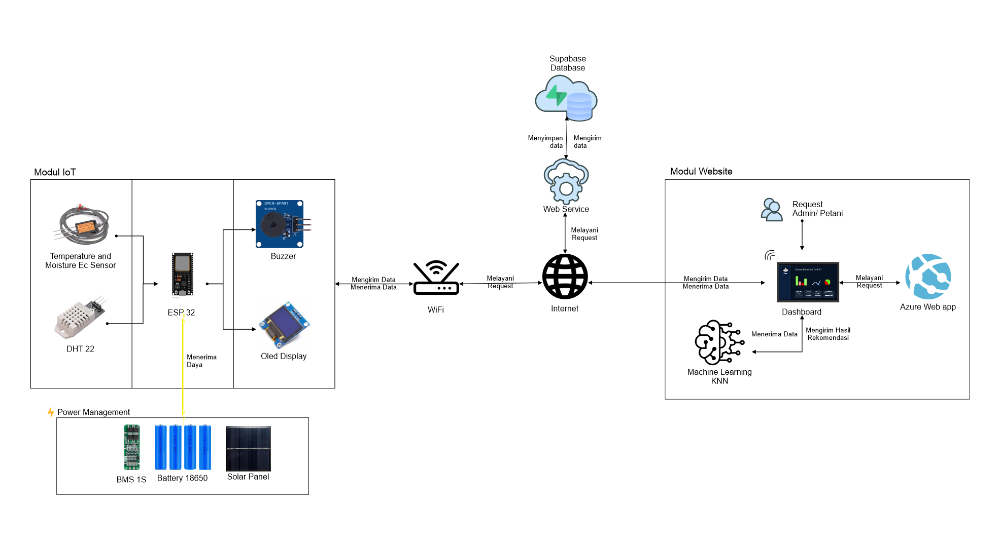
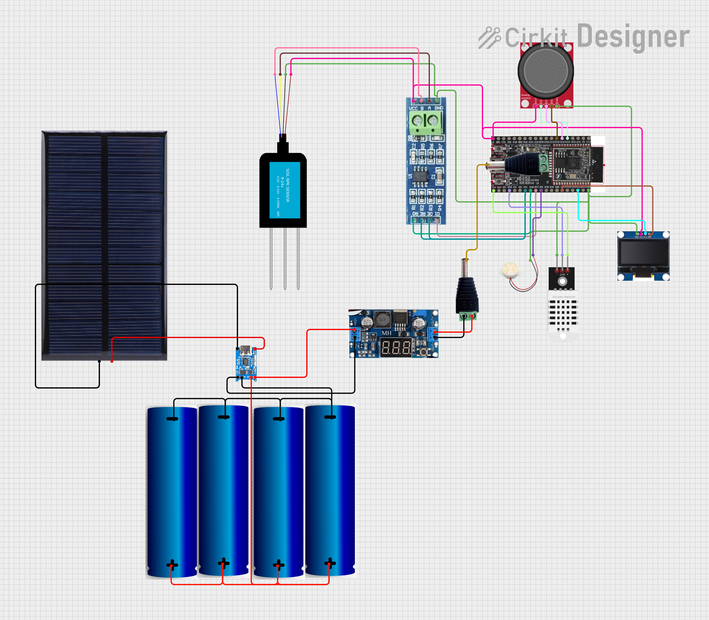

# 🌱 SoilMonitor: Sistem Rekomendasi Pemupukan Cerdas Berbasis IoT & AI


**SoilMonitor** adalah sistem pertanian presisi (*precision agriculture*) yang memantau kondisi tanah secara *real-time* dan memberikan rekomendasi pemupukan otomatis menggunakan algoritma **K-Nearest Neighbors (KNN)**. Sistem ini terintegrasi dengan dashboard web berbasis cloud untuk pemantauan jarak jauh.

---
## 📸 Dashboard Preview



## Architecture System



## ✨ Fitur Utama

### 📡 IoT Hardware (ESP32)
* **7-in-1 Monitoring**: Membaca Kelembapan, Suhu Tanah, EC (Electrical Conductivity), Salinitas, TDS, Suhu Udara, dan Kelembapan Udara.
* **OLED & Joystick Interface**: Navigasi menu langsung di perangkat tanpa perlu membuka HP.
* **Offline/Online Mode**: Menggunakan `WiFiManager` untuk koneksi fleksibel.
* **Industrial Sensor**: Mendukung sensor tanah RS485 Modbus yang tahan lama dan akurat.

### 🧠 AI & Software
* **Rekomendasi Cerdas**: Menggunakan model KNN untuk menentukan jenis pupuk (Urea, SP-36, KCl, NPK, Kompos) berdasarkan data sensor.
* **Web Dashboard**: Visualisasi grafik tren (Chart.js), manajemen pengguna (Admin/User), dan ekspor data (CSV/JSON).
* **Cloud Database**: Penyimpanan data historis tanpa batas menggunakan Supabase.

---

## 🛠️ Tech Stack

* **Microcontroller**: ESP32 DevKit V1
* **Sensor**: RS485 Soil Sensor (7-in-1), DHT22
* **Display**: OLED SSD1306 (I2C)
* **Backend**: Supabase (PostgreSQL, Auth, REST API)
* **Firmware**: C++ (Arduino IDE)
* **Frontend**: HTML5, CSS3, JavaScript (Single File Application)

---

## 🔌 Skema Rangkaian (Pinout)



Berikut adalah konfigurasi pin yang digunakan pada ESP32:

| Komponen | Pin ESP32 | Keterangan |
| :--- | :--- | :--- |
| **RS485 RO (RX)** | GPIO 16 | Serial 2 RX |
| **RS485 DI (TX)** | GPIO 17 | Serial 2 TX |
| **RS485 DE/RE** | GPIO 4 | Kontrol Transmisi |
| **DHT Sensor** | GPIO 15 | Suhu & Lembap Udara |
| **OLED SDA** | GPIO 21 | I2C Data |
| **OLED SCL** | GPIO 22 | I2C Clock |
| **Joystick X** | GPIO 34 | Analog Input |
| **Joystick Y** | GPIO 35 | Analog Input |
| **Joystick Btn** | GPIO 32 | Digital Input (Pullup) |
| **Buzzer** | GPIO 5 | Aktif High |

---

## 🚀 Instalasi & Penggunaan

### 1. Persiapan Database (Supabase)
Buat proyek baru di [Supabase](https://supabase.com) dan jalankan query SQL berikut di SQL Editor untuk membuat tabel yang diperlukan:

```sql
-- Tabel Pembacaan Sensor
create table readings (
  id bigint generated by default as identity primary key,
  timestamp timestamptz default now(),
  device_id uuid,
  soil_moisture float,
  soil_temp float,
  soil_ec float,
  soil_salinity float,
  soil_tds float,
  air_temp float,
  air_humidity float,
  is_recommendation boolean default false,
  rekomendasi text -- Opsional: menyimpan hasil text rekomendasi
);

-- Tabel Pengguna (Opsional jika pakai Auth bawaan, tapi sesuai kode dashboard)
create table users (
  id uuid default uuid_generate_v4() primary key,
  email text unique,
  password text, -- Disarankan hash di client-side
  name text,
  role text default 'user',
  created_at timestamptz default now()
);
